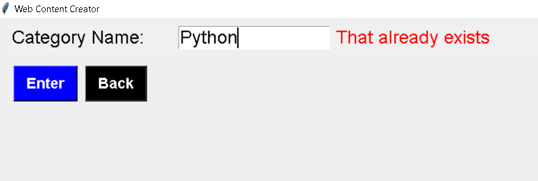
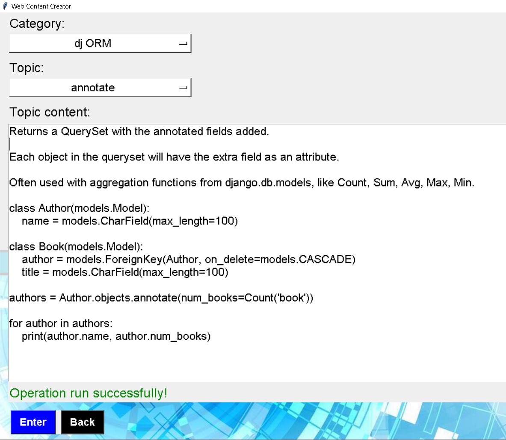

A Tkinter GUI app that handles files, generates HTML code and syncs it with a PostgreSQL DB. I use it to write little sticky notes with interesting things I learn. 

Web page: https://yoanabast.github.io/note_builder_gui/

The GUI app runs when starting the gui_main.py file. 
It offers the following options: Add category; Remove Category; Add Topic; Remove Topic; Add Text Content; Add Image Content; Clear Content;

The only HTML I have written here is the templates. My program then reuses them to handle everything. 

## License

This project is open source and available under the [MIT License](LICENSE).  
Feel free to use or adapt it — just give credit. 🙂
